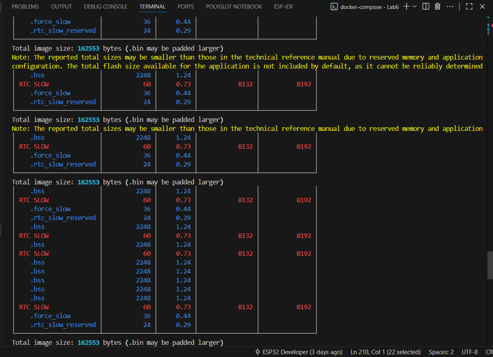
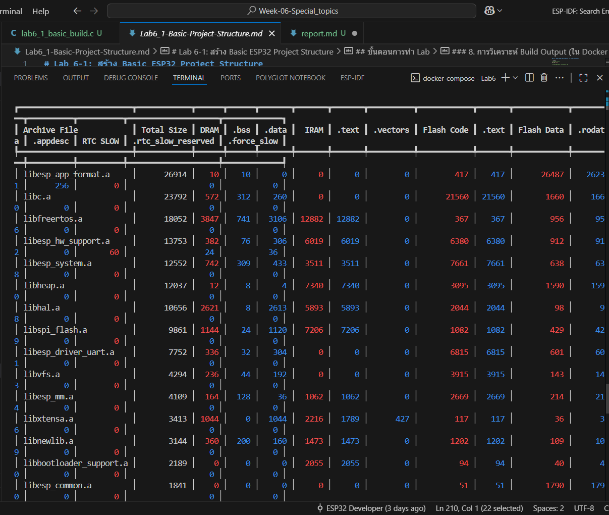

##
┏━━━━━━━━━━━━━━━━━━━━━━━━━┳━━━━━━━━━━━━┳━━━━━━┳━━━━━━┳━━━━━━━┳━━━━━━━┳━━━━━━━┳━━━━━━━━━━┳━━━━━━━━━━━━┳━━━━━━━┳━━━━━━━━━━━━┳━━━━━━━━━┳━━━━━━━━━━┳━━━━━━━━━━┳━━━━━━━━━━━━━━━━━━━━┳━━━━━━━━━━━━━┓
┃ Archive File            ┃ Total Size ┃ DRAM ┃ .bss ┃ .data ┃  IRAM ┃ .text ┃ .vectors ┃ Flash Code ┃ .text ┃ Flash Data ┃ .rodata ┃ .appdesc ┃ RTC SLOW ┃ .rtc_slow_reserved ┃ .force_slow ┃
┡━━━━━━━━━━━━━━━━━━━━━━━━━╇━━━━━━━━━━━━╇━━━━━━╇━━━━━━╇━━━━━━━╇━━━━━━━╇━━━━━━━╇━━━━━━━━━━╇━━━━━━━━━━━━╇━━━━━━━╇━━━━━━━━━━━━╇━━━━━━━━━╇━━━━━━━━━━╇━━━━━━━━━━╇━━━━━━━━━━━━━━━━━━━━╇━━━━━━━━━━━━━┩
│ libesp_app_format.a     │      26914 │   10 │   10 │     0 │     0 │     0 │        0 │        417 │   417 │      26487 │   26231 │      256 │        0 │                  0 │           0 │
│ libc.a                  │      23792 │  572 │  312 │   260 │     0 │     0 │        0 │      21560 │ 21560 │       1660 │    1660 │        0 │        0 │                  0 │           0 │
│ libfreertos.a           │      18052 │ 3847 │  741 │  3106 │ 12882 │ 12882 │        0 │        367 │   367 │        956 │     956 │        0 │        0 │                  0 │           0 │
│ libesp_hw_support.a     │      13753 │  382 │   76 │   306 │  6019 │  6019 │        0 │       6380 │  6380 │        912 │     912 │        0 │       60 │                 24 │          36 │
│ libesp_system.a         │      12552 │  742 │  309 │   433 │  3511 │  3511 │        0 │       7661 │  7661 │        638 │     638 │        0 │        0 │                  0 │           0 │
│ libheap.a               │      12037 │   12 │    8 │     4 │  7340 │  7340 │        0 │       3095 │  3095 │       1590 │    1590 │        0 │        0 │                  0 │           0 │
│ libhal.a                │      10656 │ 2621 │    8 │  2613 │  5893 │  5893 │        0 │       2044 │  2044 │         98 │      98 │        0 │        0 │                  0 │           0 │
│ libspi_flash.a          │       9861 │ 1144 │   24 │  1120 │  7206 │  7206 │        0 │       1082 │  1082 │        429 │     429 │        0 │        0 │                  0 │           0 │
│ libesp_driver_uart.a    │       7752 │  336 │   32 │   304 │     0 │     0 │        0 │       6815 │  6815 │        601 │     601 │        0 │        0 │                  0 │           0 │
│ libvfs.a                │       4294 │  236 │   44 │   192 │     0 │     0 │        0 │       3915 │  3915 │        143 │     143 │        0 │        0 │                  0 │           0 │
│ libesp_mm.a             │       4109 │  164 │  128 │    36 │  1062 │  1062 │        0 │       2669 │  2669 │        214 │     214 │        0 │        0 │                  0 │           0 │
│ libxtensa.a             │       3413 │ 1044 │    0 │  1044 │  2216 │  1789 │      427 │        117 │   117 │         36 │      36 │        0 │        0 │                  0 │           0 │
│ libnewlib.a             │       3144 │  360 │  200 │   160 │  1473 │  1473 │        0 │       1202 │  1202 │        109 │     109 │        0 │        0 │                  0 │           0 │
│ libbootloader_support.a │       2189 │    0 │    0 │     0 │  2055 │  2055 │        0 │         94 │    94 │         40 │      40 │        0 │        0 │                  0 │           0 │
│ libesp_common.a         │       1841 │    0 │    0 │     0 │     0 │     0 │        0 │         51 │    51 │       1790 │    1790 │        0 │        0 │                  0 │           0 │
│ libsoc.a                │       1521 │   40 │    0 │    40 │    37 │    37 │        0 │          0 │     0 │       1444 │    1444 │        0 │        0 │                  0 │           0 │
│ liblog.a                │       1258 │  284 │  276 │     8 │   329 │   329 │        0 │        621 │   621 │         24 │      24 │        0 │        0 │                  0 │           0 │
│ libesp_ringbuf.a        │       1150 │    0 │    0 │     0 │  1053 │  1053 │        0 │          0 │     0 │         97 │      97 │        0 │        0 │                  0 │           0 │
│ libesp_partition.a      │       1035 │    8 │    8 │     0 │     0 │     0 │        0 │        990 │   990 │         37 │      37 │        0 │        0 │                  0 │           0 │
│ libesp_rom.a            │        801 │    0 │    0 │     0 │   245 │   245 │        0 │          0 │     0 │        556 │     55│ libsoc.a                │       1521 │   40 │    0 │    40 │    37 │    37 │        0 │          0 │     0 │       1444 │    1444 │        0 │        0 │                  0 │           0 │
│ liblog.a                │       1258 │  284 │  276 │     8 │   329 │   329 │        0 │        621 │   621 │         24 │      24 │        0 │        0 │                  0 │           0 │
│ libesp_ringbuf.a        │       1150 │    0 │    0 │     0 │  1053 │  1053 │        0 │          0 │     0 │         97 │      97 │        0 │        0 │                  0 │           0 │
│ libesp_partition.a      │       1035 │    8 │    8 │     0 │     0 │     0 │        0 │        990 │   990 │         37 │      37 │        0 │        0 │                  0 │           0 │
│ libesp_rom.a            │        801 │    0 │    0 │     0 │   245 │   245 │        0 │          0 │     0 │        556 │     55│ liblog.a                │       1258 │  284 │  276 │     8 │   329 │   329 │        0 │        621 │   621 │         24 │      24 │        0 │        0 │                  0 │           0 │
│ libesp_ringbuf.a        │       1150 │    0 │    0 │     0 │  1053 │  1053 │        0 │          0 │     0 │         97 │      97 │        0 │        0 │                  0 │           0 │
│ libesp_partition.a      │       1035 │    8 │    8 │     0 │     0 │     0 │        0 │        990 │   990 │         37 │      37 │        0 │        0 │                  0 │           0 │
│ libesp_rom.a            │        801 │    0 │    0 │     0 │   245 │   245 │        0 │          0 │     0 │        556 │     557 │        0 │        0 │                  0 │           0 │
│ libesp_partition.a      │       1035 │    8 │    8 │     0 │     0 │     0 │        0 │        990 │   990 │         37 │      37 │        0 │        0 │                  0 │           0 │
│ libesp_rom.a            │        801 │    0 │    0 │     0 │   245 │   245 │        0 │          0 │     0 │        556 │     55│ libesp_partition.a      │       1035 │    8 │    8 │     0 │     0 │     0 │        0 │        990 │   990 │         37 │      37 │        0 │        0 │                  0 │           0 │
│ libesp_rom.a            │        801 │    0 │    0 │     0 │   245 │   245 │        0 │          0 │     0 │        556 │     557 │        0 │        0 │                  0 │           0 │
│ libesp_rom.a            │        801 │    0 │    0 │     0 │   245 │   245 │        0 │          0 │     0 │        556 │     556 │        0 │        0 │                  0 │           0 │
│ libesp_rom.a            │        801 │    0 │    0 │     0 │   245 │   245 │        0 │          0 │     0 │        556 │     556 │        0 │        0 │                  0 │           0 │
6 │        0 │        0 │                  0 │           0 │
│ libesp_vfs_console.a    │        677 │   16 │   16 │     0 │     0 │     0 │        0 │        481 │   481 │        180 │     180 │        0 │        0 │                  0 │           0 │
│ libesp_vfs_console.a    │        677 │   16 │   16 │     0 │     0 │     0 │        0 │        481 │   481 │        180 │     180 │        0 │        0 │                  0 │           0 │
0 │        0 │        0 │                  0 │           0 │
│ libesp_timer.a          │        536 │    8 │    8 │     0 │   145 │   145 │        0 │        375 │   375 │          8 │       8 │        0 │        0 │                  0 │           0 │
│ libesp_timer.a          │        536 │    8 │    8 │     0 │   145 │   145 │        0 │        375 │   375 │          8 │       8 │        0 │        0 │                  0 │           0 │
│ libxt_hal.a             │        475 │    0 │    0 │     0 │   443 │   443 │        0 │          0 │     0 │         32 │      32 │        0 │        0 │                  0 │           0 │
8 │        0 │        0 │                  0 │           0 │
│ libxt_hal.a             │        475 │    0 │    0 │     0 │   443 │   443 │        0 │          0 │     0 │         32 │      32 │        0 │        0 │                  0 │           0 │
│ libefuse.a              │        319 │    0 │    0 │     0 │     0 │     0 │        0 │        263 │   263 │         56 │      5│ libxt_hal.a             │        475 │    0 │    0 │     0 │   443 │   443 │        0 │          0 │     0 │         32 │      32 │        0 │        0 │                  0 │           0 │
│ libefuse.a              │        319 │    0 │    0 │     0 │     0 │     0 │        0 │        263 │   263 │         56 │      52 │        0 │        0 │                  0 │           0 │
│ libefuse.a              │        319 │    0 │    0 │     0 │     0 │     0 │        0 │        263 │   263 │         56 │      56 │        0 │        0 │                  0 │           0 │
│ libapp_update.a         │        183 │    4 │    4 │     0 │     0 │     0 │        0 │        149 │   149 │         30 │      30 │        0 │        0 │                  0 │           0 │
│ libefuse.a              │        319 │    0 │    0 │     0 │     0 │     0 │        0 │        263 │   263 │         56 │      56 │        0 │        0 │                  0 │           0 │
│ libapp_update.a         │        183 │    4 │    4 │     0 │     0 │     0 │        0 │        149 │   149 │         30 │      30 │        0 │        0 │                  0 │           0 │
6 │        0 │        0 │                  0 │           0 │
│ libapp_update.a         │        183 │    4 │    4 │     0 │     0 │     0 │        0 │        149 │   149 │         30 │      30 │        0 │        0 │                  0 │           0 │
0 │        0 │        0 │                  0 │           0 │
│ libmain.a               │        126 │    0 │    0 │     0 │     0 │     0 │        0 │        126 │   126 │          0 │       │ libmain.a               │        126 │    0 │    0 │     0 │     0 │     0 │        0 │        126 │   126 │          0 │       0 │        0 │        0 │                  0 │           0 │
│ libpthread.a            │         25 │    0 │    0 │     0 │     0 │     0 │        0 │         25 │    25 │          0 │       0 │        0 │        0 │                  0 │           0 │
│ libesp_security.a       │         20 │    0 │    0 │     0 │     0 │     0 │        0 │         12 │    12 │          8 │       8 │        0 │        0 │                  0 │           0 │
│ libcxx.a                │         10 │    0 │    0 │     0 │     0 │     0 │        0 │         10 │    10 │          0 │       0 │        0 │        0 │                  0 │           0 │
│ libnvs_sec_provider.a   │          5 │    0 │    0 │     0 │     0 │     0 │        0 │          5 │     5 │          0 │       0 │        0 │        0 │                  0 │           0 │
│ libesp_phy.a            │          5 │    0 │    0 │     0 │     0 │     0 │        0 │          5 │     5 │          0 │       │ libpthread.a            │         25 │    0 │    0 │     0 │     0 │     0 │        0 │         25 │    25 │          0 │       0 │        0 │        0 │                  0 │           0 │
│ libesp_security.a       │         20 │    0 │    0 │     0 │     0 │     0 │        0 │         12 │    12 │          8 │       8 │        0 │        0 │                  0 │           0 │
│ libcxx.a                │         10 │    0 │    0 │     0 │     0 │     0 │        0 │         10 │    10 │          0 │       0 │        0 │        0 │                  0 │           0 │
│ libnvs_sec_provider.a   │          5 │    0 │    0 │     0 │     0 │     0 │        0 │          5 │     5 │          0 │       0 │        0 │        0 │                  0 │           0 │
│ libpthread.a            │         25 │    0 │    0 │     0 │     0 │     0 │        0 │         25 │    25 │          0 │       0 │        0 │        0 │                  0 │           0 │
│ libesp_security.a       │         20 │    0 │    0 │     0 │     0 │     0 │        0 │         12 │    12 │          8 │       8 │        0 │        0 │                  0 │           0 │
│ libcxx.a                │         10 │    0 │    0 │     0 │     0 │     0 │        0 │         10 │    10 │          0 │       0 │        0 │        0 │                  0 │           0 │
│ libpthread.a            │         25 │    0 │    0 │     0 │     0 │     0 │        0 │         25 │    25 │          0 │       0 │        0 │        0 │                  0 │           0 │
│ libesp_security.a       │         20 │    0 │    0 │     0 │     0 │     0 │        0 │         12 │    12 │          8 │       8 │        0 │        0 │                  0 │           0 │
│ libpthread.a            │         25 │    0 │    0 │     0 │     0 │     0 │        0 │         25 │    25 │          0 │       0 │        0 │        0 │                  0 │           0 │
│ libpthread.a            │         25 │    0 │    0 │     0 │     0 │     0 │        0 │         25 │    25 │          0 │       │ libpthread.a            │         25 │    0 │    0 │     0 │     0 │     0 │        0 │         25 │    25 │          0 │       0 │        0 │        0 │                  0 │           0 │
│ libesp_security.a       │         20 │    0 │    0 │     0 │     0 │     0 │        0 │         12 │    12 │          8 │       8 │        0 │        0 │                  0 │           0 │
│ libcxx.a                │         10 │    0 │    0 │     0 │     0 │     0 │        0 │         10 │    10 │          0 │       0 │        0 │        0 │                  0 │           0 │
│ libnvs_sec_provider.a   │          5 │    0 │    0 │     0 │     0 │     0 │        0 │          5 │     5 │          0 │       0 │        0 │        0 │                  0 │           0 │
│ libesp_phy.a            │          5 │    0 │    0 │     0 │     0 │     0 │        0 │          5 │     5 │          0 │       0 │        0 │        0 │                  0 │           0 │
└─────────────────────────┴────────────┴──────┴──────┴───────┴───────┴───────┴──────────┴────────────┴───────┴────────────┴─────────┴──────────┴──────────┴────────────────────┴─────────────┘

